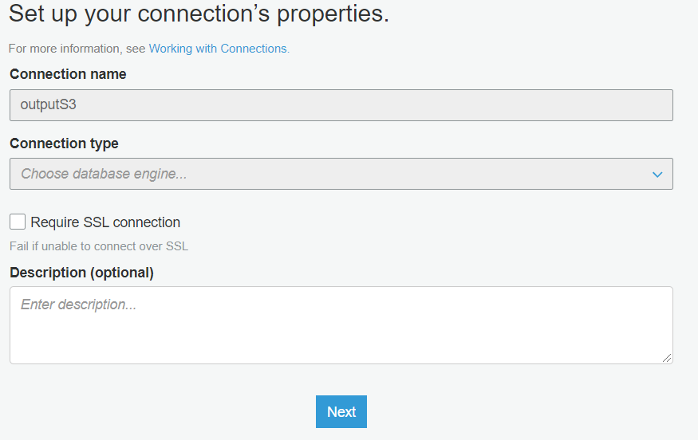
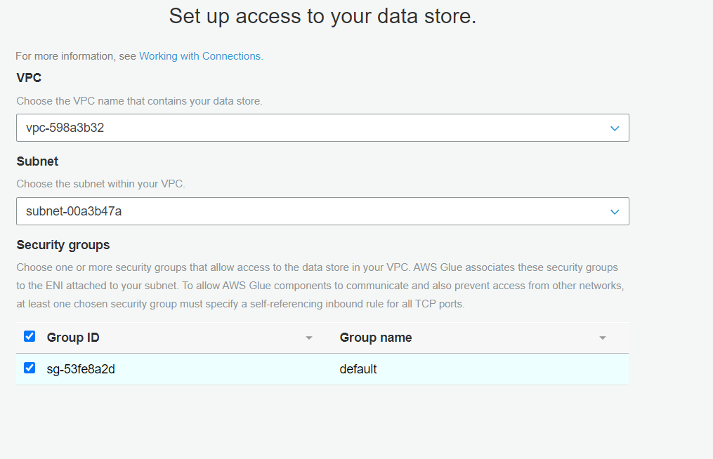
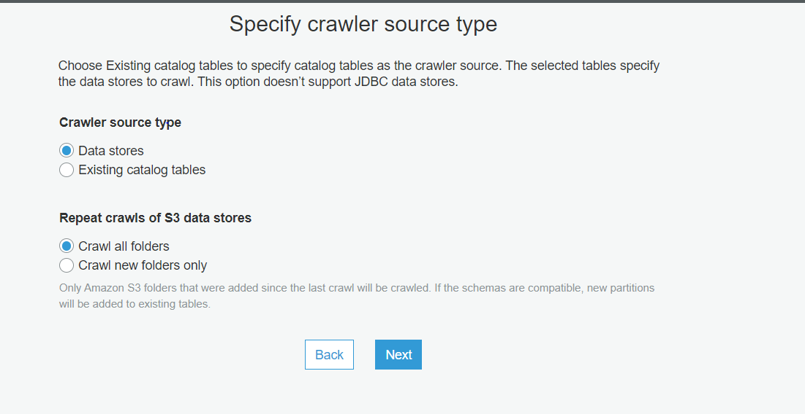
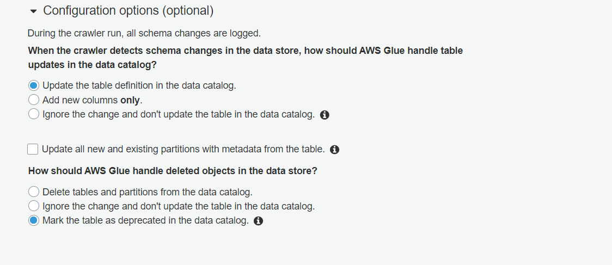

# Combines multiple databases available in S3 Data-lake

## Create S3 Bucket
           bucket name : [alldatabasesdestination]
           Versioning:off

## Create RDS For Combine Database(MYSQL)
        create parameter for mysql:
           set the following configuration 
              binlog_format = ROW (Do same in production rds )
              max_connections=100000
              connect_timeout=300000
        

## RDS to S3 data migration using AWS DMS

***1- Create Replication Instance For Data migration***

**2-Create Endpoints for source and destination source:**

Configuration For s3 :alldatabasesdestination

	define Extra connection attributes:

		addColumnName=true;bucketName=alldatabasesdestination;compressionType=NONE;csvDelimiter=,;csvRowDelimiter=\n;dataFormat=parquet;datePartitionEnabled=false;encodingType=plain-  dictionary;includeOpForFullLoad=true;parquetTimestampInMillisecond=true;

	  
Target Configuration For MySQL :bazaarinitial:

	Server name : [bazaarinitial.c7i6z2eoo1cg.us-east-2.rds.amazonaws.com](https://console.aws.amazon.com/rds/home?region=us-east-2#database:id=bazaarinitial;is-cluster=false)
	Port:3306
	Endpoint type: Source
	User name:admin

  ## Create Database migration tasks
          select source and destination endpoint
		  define mapping rule -->Selection rules -->'%databasename

## AWS Glue Task (s3 to rds)

	Crawler name : crawler_name

### Glue Connection:

step 1:

step 2:

			   

### Glue Crawler:

1-select crawler source type

2-add s3 table path

3-Configure the crawler's output:
			set the following configuration 
			

## Glue Jobs
	
### 1-Generate Secret Key: 
      generate rds credentail for glue script using secret manager

### 2-Glue script :
    1-create new script 
    2-select option "A new script to be authored by you"
    3-Mark select Job metrics, Continuous logging  in Monitoring options properties      
       
      

## Glue Workflows
 	 1- create glue work flow 
	 2-create 2 Triger function one for crawler and another for job 
	 3-In Glue triger set crawler on schedule and on another triger set Trigger logic on Start after ALL watched event
	       
